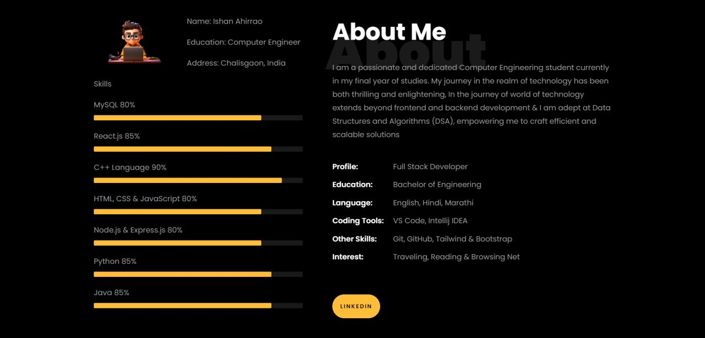
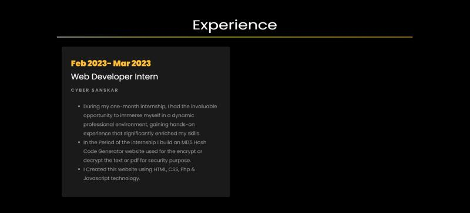
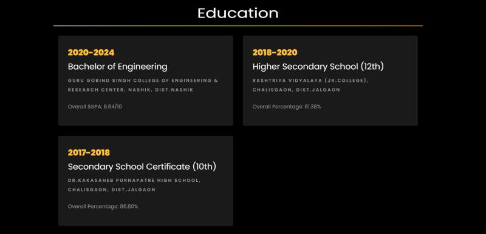
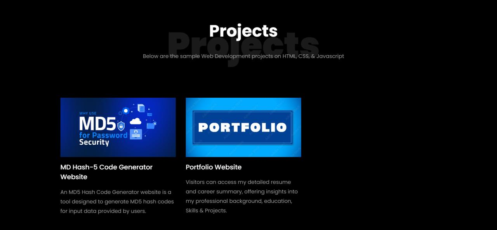
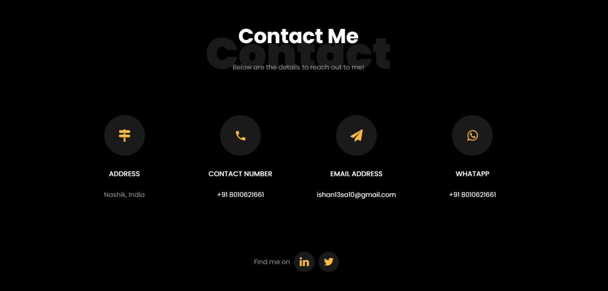

# ishan-ahirrao-personal-portfolio
My personal portfolio is a collection of projects and works that showcase skills and experiences in various fields. The portfolio may also include other projects and skills that demonstrate Ishan Ahirrao's expertise and versatility as a professional.

Visit My Site <a href="https://readme.com/" target="_blank">Portfolio</a>
#

Home Screen represent the basic introduction.

#

About page represent the skills and basics description about profile.

#

These page represent the experience about working.

#

These page represent the education details.

#

These page represent the projects details with the github link.

#

These page represent the contact details.

